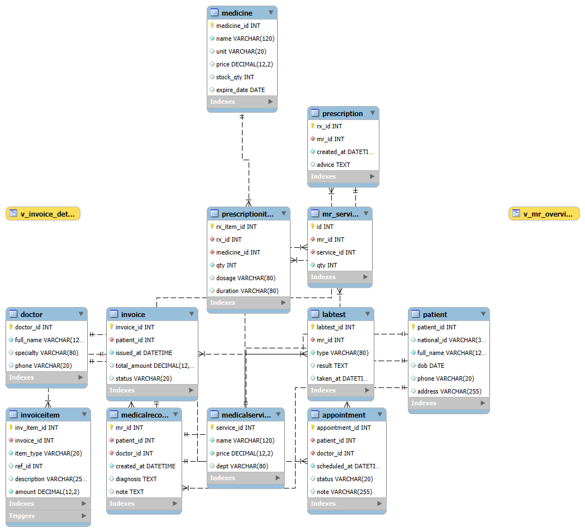
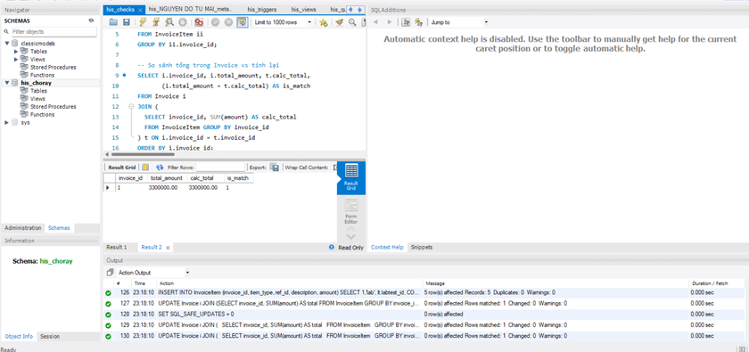
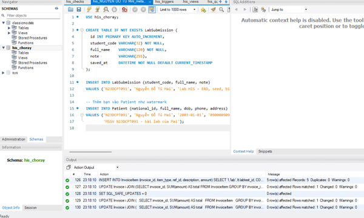

# 💊 HỆ THỐNG QUẢN LÝ KHÁM CHỮA BỆNH – HIS CHỢ RẪY  
**Nguyễn Đỗ Tú Mai – N23DCPT091**  
Môn học: *Nhập môn Công nghệ Phần mềm – Lecture 5&6: Requirements Analysis*

---

## 🔗 Tệp tin chính (bấm để mở hoặc tải về)

- 📦 **Cấu trúc CSDL – SQL Export:** [`his_schema_choray.sql`](his_schema_choray.sql)
- 📜 **Ràng buộc & kiểm tra:** [`his_checks.sql`](his_checks.sql)
- ⚙️ **Trigger (Kích hoạt sự kiện):** [`his_triggers.sql`](his_triggers.sql)
- 👁️ **Views (Giao diện dữ liệu):** [`his_views.sql`](his_views.sql)
- 🧩 **Seed (Dữ liệu mẫu):** [`his_seed.sql`](his_seed.sql)
- 🔍 **Các truy vấn tổng hợp:** [`his_queries.sql`](his_queries.sql)
- 🧾 **File SQL tổng hợp – Metadata:** [`his_NGUYEN DO TU MAI_meta_N23DCPT091.sql`](his_NGUYEN%20DO%20TU%20MAI_meta_N23DCPT091.sql)
- 📄 **Bài tập Word (Câu hỏi lý thuyết):** [`NGUYỄN ĐỖ TÚ MAI-N23DCPT091-LECTURE5.docx`](NGUYỄN%20ĐỖ%20TÚ%20MAI-N23DCPT091-LECTURE5.docx)
- 📦 **Zip toàn bộ project MySQL:** [`N23DCPT091_NguyenDoTuMai_HIS_Lab.zip`](N23DCPT091_NguyenDoTuMai_HIS_Lab.zip)

---

## 🏥 1. Giới thiệu hệ thống

**Hệ thống quản lý khám chữa bệnh (HIS - Hospital Information System)** được thiết kế để:  
- Quản lý thông tin bệnh nhân, hồ sơ bệnh án, lịch hẹn, và quy trình khám chữa bệnh.  
- Hỗ trợ bác sĩ, nhân viên tiếp nhận, phòng xét nghiệm, nhà thuốc và hệ thống BHYT.  
- Tự động hóa quy trình và giảm tải khâu hành chính.

**Schema:** `his_choray`  
**Số bảng:** 8 bảng chính + các đối tượng mở rộng (trigger, views, seed, meta).

---

## 🧱 2. Cấu trúc cơ sở dữ liệu

| STT | Tên bảng | Mô tả |
|-----|-----------|-------|
| 1 | `benhnhan` | Thông tin bệnh nhân |
| 2 | `bacsi` | Thông tin bác sĩ |
| 3 | `lichhen` | Lịch hẹn khám bệnh |
| 4 | `hosobenhan` | Hồ sơ bệnh án (EMR) |
| 5 | `xetnghiem` | Kết quả xét nghiệm |
| 6 | `donthuoc` | Đơn thuốc bác sĩ kê |
| 7 | `thuoc` | Kho thuốc, danh mục thuốc |
| 8 | `hoadon` | Viện phí, thanh toán & bảo hiểm |

**Quan hệ chính:**  
- BN ↔ Lịch hẹn / Hồ sơ bệnh án / Hóa đơn  
- BS ↔ Hồ sơ bệnh án / Đơn thuốc / Lịch hẹn  
- HSBA ↔ Xét nghiệm / Đơn thuốc  
- Đơn thuốc ↔ Thuốc  

---

## 🧩 3. Các thành phần mở rộng
- **Triggers:** Tự động cập nhật trạng thái khi thêm/sửa dữ liệu.  
- **Views:** Tổng hợp dữ liệu giữa các bảng liên quan.  
- **Checks:** Đảm bảo ràng buộc logic khi nhập liệu.  
- **Seed:** Chèn dữ liệu mẫu để test hệ thống.  
- **Queries:** Tổng hợp các câu truy vấn JOIN và kiểm tra FK.

---

## 🧠 4. Câu hỏi củng cố lý thuyết (Trắc nghiệm / Tình huống / Use Case)
- File: [`NGUYỄN ĐỖ TÚ MAI-N23DCPT091-LECTURE5.docx`](NGUYỄN%20ĐỖ%20TÚ%20MAI-N23DCPT091-LECTURE5.docx)  
- Bao gồm:  
  - 10 câu **trắc nghiệm** về yêu cầu phần mềm  
  - 10 câu **trả lời ngắn**  
  - 10 câu **tình huống thực tế** theo bài giảng thầy cung cấp.  

---

## 📸 5. Minh chứng thao tác MySQL Workbench

**Ảnh ERD – tổng thể từ Workbench:**  


**Ảnh cấu trúc sơ đồ Workbench (.mwb):**  
[`ERD_HIS_from_SQL.mwb`](ERD_HIS_from_SQL.mwb)

**Ảnh giao diện chạy lệnh – Workbench (thực thi script):**  
  


---

## 🧾 6. Hướng dẫn thực thi nhanh

1. Mở **MySQL Workbench** → *File → Open SQL Script* → chọn `his_schema_choray.sql`.  
2. Bấm **Execute All (tia sét)** để chạy toàn bộ.  
3. Thực thi lần lượt các file bổ sung:
```

his_seed.sql
his_triggers.sql
his_views.sql
his_checks.sql
his_queries.sql

````
4. Kiểm tra:
```sql
SHOW TABLES;
SELECT * FROM benhnhan LIMIT 5;
SELECT * FROM hosobenhan LIMIT 5;
````

---

## 📂 7. Cấu trúc repo

```
HIS-BVCHORAY-LECTURE56-REQUIREMENTS/
│
├── ERD_HIS_from_SQL.mwb
├── ERD_HIS_from_SQL.png
├── N23DCPT091_NguyenDoTuMai_HIS_Lab.zip
├── NGUYỄN ĐỖ TÚ MAI-N23DCPT091-LECTURE5.docx
├── his_NGUYEN DO TU MAI_meta_N23DCPT091.sql
├── his_schema_choray.sql
├── his_seed.sql
├── his_triggers.sql
├── his_views.sql
├── his_checks.sql
├── his_queries.sql
├── screenshot_invoice_total.png
├── screenshot_labsubmission.png
└── README.md
```

---

## 👩‍💻 8. Thông tin sinh viên

| Họ và tên            | MSSV           | Lớp      | Ghi chú                                                                    |
| -------------------- | -------------- | -------- | -------------------------------------------------------------------------- |
| **Nguyễn Đỗ Tú Mai** | **N23DCPT091** | D23CQPTTK01-N| Hoàn thành bài thực hành Lecture 5–6 – Requirements Analysis (HIS Chợ Rẫy) và bài tập củng cố lí thuyết |

---

> 📘 *Toàn bộ nội dung trong repo là sản phẩm học tập thuộc môn “Nhập môn Công nghệ Phần mềm”,
> được thực hiện theo yêu cầu bài tập Case Study – HIS Bệnh viện Chợ Rẫy.*
